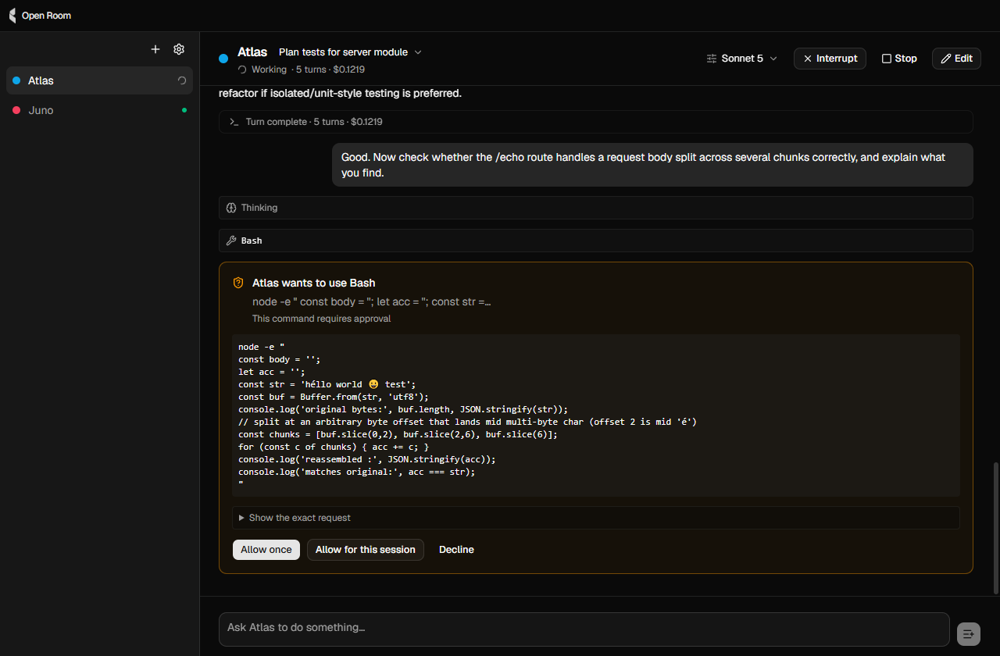

# Open Room

A desktop app for running several named Claude Code agents at once and talking to them — by voice or by typing — while you get on with something else.

Each agent is a persona: it has a name, a colour, its own model and tool access, a voice, a workspace folder, and a persistent `AGENT.md` describing its role. You address one by name ("hey Atlas, run the tests"), or press a hotkey and speak, or type into its chat pane. It works in the background and reports back through a native notification or, if you enable it, out loud in its own voice. Conversations persist across restarts, so an agent you spoke to yesterday remembers what you were doing.



Open Room is a **conversational layer over Claude Code**, not a task launcher wrapped around it. Every agent is a real Claude Code session driven through the [Agent SDK](https://docs.anthropic.com/en/docs/agent-sdk), and its chat pane shows exactly what the terminal would.

> **Read this first.** Open Room uses the Claude Code account already logged in on your machine. It ships no credentials, handles no API keys, and never proxies anyone else's account — every turn any agent runs bills *your* subscription. Running four agents concurrently means four Claude Code sessions drawing on one account; rate-limit events are surfaced in the app because they are a routine part of that.

Everything stays on your machine. There is no telemetry and no analytics. Claude Code talks to Anthropic, and speech-to-text and text-to-speech both run locally. The one other request the app makes is an update check against this repository's GitHub releases, at launch and every six hours: it sends the app's name and version and nothing else, and it can be turned off in Settings.

Windows and macOS. Windows is verified; macOS is configured but has not yet been run on a Mac.

---

## Contents

- [Getting started](#getting-started)
- [How it works](#how-it-works)
  - [Process architecture](#process-architecture)
  - [Agents are Claude Code sessions](#agents-are-claude-code-sessions)
  - [Conversations persist](#conversations-persist)
  - [Tools and permissions](#tools-and-permissions)
  - [Pointing and receiving](#pointing-and-receiving)
  - [How agents talk back](#how-agents-talk-back)
  - [The voice sidecar](#the-voice-sidecar)
  - [Voice input](#voice-input)
  - [Custom wake words without training](#custom-wake-words-without-training)
  - [Not hearing yourself](#not-hearing-yourself)
  - [Quota, context and concurrency](#quota-context-and-concurrency)
  - [Running an agent inside WSL](#running-an-agent-inside-wsl)
- [Where things live on disk](#where-things-live-on-disk)
- [Development](#development)
- [Design decisions worth knowing before contributing](#design-decisions-worth-knowing-before-contributing)
- [Status](#status)
- [Licence](#licence)

---

## Getting started

### 1. Sign in to Claude Code

Open Room detects your login rather than performing it. The sign-in is a browser-plus-terminal flow that the Claude Code CLI owns, so:

```bash
npm install -g @anthropic-ai/claude-code
claude          # follow the sign-in prompts, then exit
```

That writes the login to `~/.claude`, which every Claude CLI on the machine shares — including the one bundled inside Open Room. You need the global install to sign in, not to run agents.

If Open Room launches and you are not signed in, it shows a first-run screen with these steps and a "check again" button.

### 2. Install Open Room

Download the installer for your platform from the [releases page](https://github.com/TheLinc/open-room/releases) (NSIS `.exe` on Windows, `.dmg` on macOS), or build it yourself — see [Development](#development).

Once installed, the app tells you when a newer release exists: a banner in the window, an item in the tray menu, and one notification per version. On Windows, Download fetches the installer inside the app and the button becomes *Restart to update*; the restart waits until no agent is mid-turn. On macOS, Download opens the release page, because an unsigned app cannot update itself there. Releases from before 0.2.0 carry no update feed, so the first update from one of those goes through the release page too.

The builds are not code-signed, so both operating systems will object once:

- **Windows:** SmartScreen shows "Windows protected your PC". Click *More info*, then *Run anyway*.
- **macOS:** Gatekeeper says the app "cannot be opened because the developer cannot be verified". Right-click the app and choose *Open*, then *Open* again in the dialog — or run `xattr -d com.apple.quarantine "/Applications/Open Room.app"`.

Nothing is bundled beyond the app: no voices, no speech models. System text-to-speech works immediately; anything neural downloads on demand, with size and licence shown before you agree.

### 3. Create an agent

Give it a name, pick a model, point it at a workspace folder. Fable models are offered too; the app asks Claude Code at launch which models your plan includes and shows the rest disabled, so an agent never fails on a model you cannot use. The editor writes two files you can edit by hand at any time:

- `~/.open-room/agents/<id>/config.json` — model, tools, voice, hotkey
- `~/.open-room/agents/<id>/AGENT.md` — the role description, prepended to every session

Type into the chat pane. The agent runs as a real Claude Code session in that folder.

### 4. (Optional) Turn on a voice

In the agent editor, enable TTS and pick a system voice — instant, offline, no download. Or pick Kokoro, a neural voice with 28 options that is identical on every platform; it fetches 163 MB of Apache-2.0 weights the first time an agent selects it.

### 5. (Optional) Turn on voice input

Voice input ships **off**. In settings, turn on push-to-talk; the switch offers the Whisper model download in place (`tiny.en` is 154 MB, `base.en` is 294 MB). Then either click the mic button beside send in an agent's pane, or press the hotkey. The default binding is `Ctrl/Cmd+Shift+Space`: press to start, speak, and either press again or stop talking to send; `Esc` discards.

Wake words ("hey Atlas …") are a separate opt-in beyond that, because they keep the microphone open. See [Voice input](#voice-input) for why that is a deliberate two-step.

---

## How it works

### Process architecture

Four kinds of process plus one small window. The separation is load-bearing.

```
Electron main (Node)            AgentSupervisor, ConfigStore, SpeechBus, Router,
                                HotkeyManager, VoiceController, AppTray
  ├─ IPC ──────────────────────→ Renderer (React + shadcn/ui): chat panes, editor, settings
  ├─ IPC ──────────────────────→ Overlay window: listening pill + working HUD.
  │                               Frameless, always-on-top, click-through. Owns the microphone.
  ├─ stdio JSON-RPC ───────────→ Voice sidecar (plain Node): Whisper, Silero VAD, TTS, model downloads
  └─ Agent SDK ────────────────→ N × `claude` CLI subprocesses, one per active agent
```

**Main** owns all state and every agent's lifecycle. The renderer holds nothing authoritative — it is display and input.

**The renderer** is a React app. Chat panes render agent output verbatim: assistant prose is drawn as markdown (terminal Claude Code does the same), and user messages, tool calls, tool results and command output are shown as-is.

**The overlay** is a separate, tiny, always-on-top window. During a voice interaction it shows a pill with the agent's name, colour, target conversation and state (listening → transcribing → dispatched → speaking). Whenever the main window is hidden or unfocused it becomes a HUD of one pip per working agent, so you can see who is busy and who is blocked on a permission prompt without raising the window. It also owns the microphone, because `getUserMedia` is a browser API and capturing audio in a plain Node process would mean a native binding for something a renderer does for free.

**The voice sidecar** is a plain Node process spoken to over stdio. It runs speech-to-text, voice-activity detection, text-to-speech synthesis and audio playback, and it downloads models. It is kept outside Electron on purpose — see [The voice sidecar](#the-voice-sidecar).

**Agent subprocesses** are spawned by `@anthropic-ai/claude-agent-sdk`, which shells out to a `claude` CLI binary the SDK ships itself. Each is a full Claude Code process, which is why concurrency is capped.

### Agents are Claude Code sessions

An agent is one long-lived `query()` call in **streaming input mode**: the SDK is handed an async generator, and user messages are pushed into that generator as they arrive. The session stays alive between turns. This is not interchangeable with the simpler one-shot mode — three things Open Room needs exist only in streaming mode: `interrupt()` to stop a run mid-tool, `setPermissionMode()` / `setModel()` to change a running session, and in-loop permission prompts that resolve without ending the session.

Three details of the SDK shape everything downstream:

- **It does not echo user input back**, so the supervisor emits the user's own message into the transcript itself, in the SDK's message shape, before pushing it to the session. Otherwise the pane would show replies with nothing to reply to.
- **An interrupt arrives as an error result**, indistinguishable from a real failure. The supervisor flags a deliberate stop so it returns the agent to "ready" rather than "needs attention".
- **Agents run with `settingSources: []`.** Without that, the SDK loads your user and project settings, and an agent inherits every MCP server, plugin and slash command on the machine — measured on one install, an agent configured with three tools was handed 73 tools and 8 MCP servers, several of which failed on every spawn. With it, an agent gets exactly what its own `config.json` says, and the same config behaves identically on a different machine. It is also a large latency win, since each of those servers was being started per turn.

Each agent gets one in-process MCP server with a single tool, `speak` — see [How agents talk back](#how-agents-talk-back).

### Conversations persist

One conversation is one SDK session, tagged `open-room:<agentId>` so an agent's conversations can be listed without parsing transcript files, and without keying off titles the user is free to change.

Launching the app selects each agent's most recent conversation, rendered and scrolled to the bottom with a `Resumed · last active 2 days ago` divider. A switcher in the pane header lists recent conversations by how they started, plus "New conversation". New conversations are always explicit — there is no idle timer and no per-launch reset, because surprise amnesia is worse than a long thread.

A finished conversation can be archived instead of deleted, from the switcher or the pane's menu. It leaves the list, sits under a collapsed "Archived" group with a countdown, and can be restored until the retention window runs out (30 days by default, adjustable in Settings, or never). Once the window passes it is deleted the same way a manual delete would be: a worktree with uncommitted work is left alone.

What makes a new conversation *cheap* is `WORKLOG.md`. Each agent's `AGENT.md` instructs it to keep one in its workspace: what it is working on, where things stand, what is blocked. A fresh context window still knows the state of play, and "what's the progress on the CI pipeline?" gets a sensible answer even in a conversation that was never about CI. It is a plain file, readable outside the app, and it survives clearing history.

A per-agent ephemeral mode (`persistSession: false`) exists for privacy: nothing on disk, at the stated cost of no history and no crash recovery.

An agent can also run each new conversation in its own git worktree (`worktrees: true`, off by default), so two agents, or an agent and you, never edit one checkout. Worktrees live under `~/.open-room/worktrees/<agent>/<slug>`, outside the repository, on a branch named `open-room/<agent>/<slug>` cut from the workspace's current HEAD, and the pane header shows the branch. Deleting the conversation removes the worktree only if it is clean and the branch only if it is merged; the app never destroys uncommitted work. Merging the branch back is your editor's and terminal's job, deliberately.

### Tools and permissions

Every tool is available to every agent. What the config controls is whether the agent asks you first. The editor offers one three-state control per tool:

- **Ask every time** (the default)
- **Always allow** — auto-approve, no prompt
- **Never allow** — hard deny; supports scoping like `Bash(rm *)`

This is modelled deliberately as three states rather than an "allowed tools" checklist, because a checklist reads as *unchecked = blocked* when it actually means *unchecked = ask*. `bypassPermissions` is never exposed in the UI — least of all for voice-initiated prompts, where the person speaking may not be the person watching the screen.

Three things can be changed for a running session from the pane header without restarting it: model, effort level, and permission mode (including plan mode, accept-edits, and Claude Code's own bounded `auto` mode). They are sticky for the session and revert to the agent's config when it ends.

A permission prompt renders in the pane with the relevant detail, the command or before/after for each edit. While the window is hidden it is a first-sorted pip in the HUD, whose row shows the same summary with Allow once, Allow for this session and Decline buttons, so it can be answered without raising the window. A question an agent asks aloud through `speak` shows there too, and the global push-to-talk hotkey aims at the agent that asked. Permissions are answered by click only, never by voice: anyone within earshot can address an agent, and approving a shell command should need a hand on the machine.

### Pointing and receiving

Open Room sits beside your editor rather than replacing it. What it owns is pointing an agent at something and seeing what it did.

- **Images** paste or drop into the composer and travel as image content blocks on the message.
- **`@file`** at a word boundary opens a fuzzy picker over the workspace. The mention is sent as typed, since the agent has `Read` and expanding the file would duplicate it into the context window.
- **Attached files**, dropped or picked with the paperclip, show as chips and become plain `@path` mentions appended to the prompt on send, so the transcript shows exactly what the agent received.
- **Files changed** per turn is read off the transcript's Edit and Write calls, not a file watcher, which would also see your own saves. Each row opens in your editor and toggles a read-only diff of the file against HEAD, or against the branch base for a worktree conversation.
- **Queued prompts** typed during a turn wait in main and go out one per completed turn; Stop discards them.

Not built on purpose: per-hunk accept and reject, inline editing, and expanding `@file` contents on the client. Those are the editor's job.

### How agents talk back

By default, an agent reports through native notifications. With TTS enabled, it speaks.

**What it says aloud comes from a tool, never from post-processing the transcript.** Each agent has an in-process MCP tool named `speak`, taking `{ message, priority }`. The agent decides what is worth saying and when — including mid-task, without ending its turn. Guidance lives in `AGENT.md` (questions, blockers and completion; one plain sentence; no paths or code), and the tool handler enforces a per-turn rate limit, refusing overflow *to the model* so it can spend its remaining budget wisely rather than narrating into a void.

If a turn finishes and the agent never called `speak`, a fallback makes sure it is still audible: a reply that is already short, plain prose is spoken as written, and anything with code, links or structure is condensed to one line by a small Haiku call through the same subscription path. Nothing in the chat pane is ever altered by this.

**All speech goes through one global `SpeechBus`** — one utterance at a time, priority-ordered (`question > blocker > done > progress`), higher priority preempting lower mid-sentence and never the reverse. Only `progress` lines expire; a question is never dropped, because an unheard question is the worst failure this app can produce. A burst of three or more collapses into the top one spoken plus one notification for the rest. Your speech stops playback immediately.

### The voice sidecar

`src/voice/` is a separate plain-Node process, launched with Electron's own `node` (`process.execPath` under `ELECTRON_RUN_AS_NODE=1`) so users need no runtime installed. It talks JSON-RPC over stdio and restarts itself after a crash.

It exists as a separate process for two reasons. `onnxruntime-node` and transformers.js are heavy and native-adjacent; keeping them out of the Electron process avoids ABI rebuilds (painful on Windows) and keeps inference off the UI thread. And it is the one place native modules are allowed at all — a future native key hook for genuine hold-to-talk goes here, never in main.

What it runs:

- **Speech-to-text:** Whisper (`tiny.en` or `base.en`) via transformers.js, ONNX, loaded from a local directory with remote fetching disabled so every model file goes through checksum-verified, resumable download.
- **Voice-activity detection:** Silero VAD, ~0.15 ms per 32 ms frame.
- **Text-to-speech:** system voices (Windows SAPI via PowerShell, macOS `say`) or Kokoro (in-process, ONNX, fp16 — measured at 624 ms for a 2.4 s clip against 1883 ms for the int8 build, so the smallest quantisation is the slowest).
- **Playback**, always as a separate short-lived process over a WAV file. That shape is load-bearing: stopping mid-sentence is then just killing that process, which is what makes preemption and barge-in possible. A fire-and-forget "speak this" API cannot be interrupted.
- **`ModelManager`**, one downloader for every model in the catalogue: size, URL, SHA-256, licence and attribution are shipped in a manifest whose hashes are measured by a script, never typed in.

Two Windows-specific costs were measured and designed around. Windows hands every PowerShell script to Defender's AMSI before it runs, and the verdict is cached by *content* — so a script with an interpolated path is scanned on every utterance (~550 ms each, twice per line spoken), while a constant script is scanned once. Both scripts therefore read all per-utterance values from the environment, and a test asserts the encoded command is byte-identical across different utterances. The sidecar also warms both scripts at start, so the first sentence an agent speaks is as fast as the tenth.

### Voice input

Two modes, both off by default.

**Push-to-talk** is the first thing to enable. It claims a global hotkey and only opens the microphone while you have asked it to. Electron's `globalShortcut` reports key-down with no key-up, so it is a toggle rather than a hold: press, speak, press again — or stop talking, and an RMS endpointer (against a noise floor sampled in the first 300 ms) ends the capture for you. `Esc` discards. Per-agent hotkeys can address one agent directly; the global one goes to whichever agent is selected, unless an agent has just asked a question aloud, in which case it goes to that agent. The mic button beside send in an agent's pane is the same toggle aimed at that agent, and with voice input off it opens Settings on the switch rather than doing nothing.

**Wake words** keep the microphone open. That is not mainly a battery question. An always-on microphone is an unauthenticated control channel into a tool with shell and file-write access — anyone within earshot, or a video playing nearby, can address an agent. The code path is the same either way; the default is what matters, and so it is a separate switch.

Talking to an agent that is mid-task never interrupts it: the prompt waits behind the running turn, and the pill says "Queued behind the current task". For a question you want answered now, say **"hey Atlas, by the way, ..."** (or "quick question"). That is a side question, the voice equivalent of Claude Code's `/btw`: it is answered from the conversation's context by a separate short-lived process, spoken back, and shown on a card above the composer, and it never enters the conversation itself. The plain wake phrase stays an instruction, because "also update the README" and "what's the status" sound identical to an app that only knows the agent is busy.

An agent with a voice acknowledges a spoken prompt straight away ("On it", or "Queued, after this task") and then reads out its own first line if that line is plain enough to speak, so you hear that it heard you and what it is about to do without raising the window. Typed prompts stay silent; the pane already shows the reply.

Both are gated on a downloaded speech model, because a shortcut that exists but cannot possibly work is worse than no shortcut. Hotkey registration failures (another app holds the combination) are reported inline against the field that owns them.

The overlay shows state throughout — which agent, which conversation, listening / transcribing / dispatched — because voice input with no visible state is what makes people distrust the feature, and showing the conversation is what stops a spoken message landing somewhere you did not expect.

### Custom wake words without training

Agent names are typed at runtime, so a trained-keyword engine (Porcupine and friends) does not fit: there is no API to mint a keyword for an arbitrary name on the fly. Open Room instead runs open transcription behind two cheap gates and matches the leading words of the transcript against the agent list. Any name works instantly.

The pipeline, cheapest stage first:

1. **RMS segmenter (overlay).** An `AudioWorklet` off the main thread watches an always-open 16 kHz stream and decides which slices are loud enough to be worth sending anywhere. In a quiet room this is one RMS per frame and a discarded buffer every few seconds; Whisper never runs. Segments keep 500 ms of pre-roll, because the gate opens partway into the first word.
2. **Silero VAD (sidecar).** Decides whether a slice is speech at all. This gate matters: a loud 220 Hz tone scores 0.07, which is exactly the music, typing and fan noise an amplitude gate passes straight through. Its verdict is a *duration* (≥ 250 ms of voiced audio), not a proportion — the segmenter pads every utterance, so a ratio depends on how quiet the room was beforehand and dropped every wake word on the floor when it was tried.
3. **Whisper (sidecar).** Only now, at hundreds of milliseconds per segment.
4. **Phonetic match (`src/shared/wake.ts`).** The transcript must start with `hey` (or Whisper's usual renderings of it), followed by up to four words compared against agent names by **double-metaphone key**, not edit distance. This runs against whatever Whisper heard: `Atlas` and `Atlus` are the same sound and must both hit, while edit distance would also accept `Atlantic`. The match is anchored to the front, so "I told him hey Derek would know" is not an address. Whatever follows the name is the prompt; a bare "hey Derek" opens the pill and starts listening.

Because matching is phonetic, name validation is too. The editor warns when two agents share a phonetic key (`Sky`/`Skye`, `Atlas`/`Atlas-2`), and additionally on single-syllable names and common English words (`Scout`, `Ready`), which misfire constantly in open transcription.

Measured cost of always-on listening: roughly 8% of one core on a 12-core desktop, most of it a 60 Hz render loop kept alive in a hidden window. Moving the gate entirely onto the worklet, which is never throttled, is the recorded next step.

### Not hearing yourself

An app that both speaks and listens has to not answer itself. Three layers, from structural to heuristic:

1. **The wake phrase requires `hey`, and no agent name is ever emitted into the audio.** The bus plays spoken lines verbatim with nothing prepended, so TTS output cannot form a valid wake phrase by construction. This is tested against the exact string the bus produces.
2. **Listening is muted for the duration of playback plus 300 ms.**
3. **Any transcript overlapping the currently-playing text by 60% is dropped as an echo.**

Barge-in is in tension with the mute: to interrupt the app you must keep listening while it speaks. The listener therefore keeps *detecting* while muted but stops *emitting* — speech during playback triggers barge-in and nothing else. That is only sound because the stream is opened with echo cancellation, so what survives subtraction of the app's own output is you.

### Quota, context and concurrency

N agents on one subscription is the app's premise and its most likely real-world failure, so the conditions around it are first-class rather than error text.

- **Quota is account state, not agent state.** The SDK emits a structured `rate_limit_event` roughly once per turn; it is held once in main and rendered as an app-level banner, because an idle agent is exactly as blocked as the one whose turn carried the event. Reaching a limit sets a distinct `paused` pip in the HUD (not "needs attention", which would be a lie) and fires one notification, only on a step up in severity.
- **Context pressure** is derived from the ordinary result message — input plus cache reads plus cache creation, per request, not the cumulative figure — and shown as a meter in the pane header. `/compact` runs from the pane, and the summary and boundary render as such rather than as a message you apparently typed.
- **Concurrency is capped** (default 3, configurable), and idle sessions are reaped after a timeout. Each agent is a full `claude` process; several idle ones is gigabytes.
- **Slash commands pass through.** The CLI executes any `/name` that arrives on the input stream, so `/compact`, `/context`, `/usage`, `/rename` and your own skills all work from the pane. Open Room owns only which commands are offered and how their output is labelled.

### Running an agent inside WSL

On Windows, an agent can be pointed at a WSL distro ("Run in WSL" in the editor, `wsl: { distro }` in its config). Its workspace is then a Linux path, and its `claude`, `git` and file listing all run inside the distro through `wsl.exe --exec`, with the same SDK session on top. Only the process launcher differs; nothing about message handling or permissions knows it is talking to a distro. The distro has its own Claude Code login, separate from the host's, and the pane names the two commands to run if it is signed out. Session history is read through a small worker whose config directory is the distro's own `~/.claude`, because the SDK reads that path process-wide and setting it in main would misdirect every other agent. Worktrees are not offered for WSL agents yet.

This is partly verified. The editor, workspace validation, the failure paths (a missing folder, a distro without `claude`) and the file listing were checked against a real distro. A full turn, the diff view, opening a file over `\\wsl.localhost`, and session resume inside a distro with Claude Code installed have not been run, because the development machine has no such distro.

---

## Where things live on disk

```
~/.open-room/
  settings.json            app settings: concurrency, hotkeys, microphone, voice input
  agents/<id>/
    config.json            model, tools, voice, hotkey, workspace
    AGENT.md               role description, prepended to every session
  models/                  downloaded Whisper / VAD models; Kokoro weights under models/kokoro
~/.claude/                 Claude Code's own login and session transcripts (not ours)
<workspace>/WORKLOG.md     each agent's running notes, kept by the agent itself
```

`OPEN_ROOM_HOME` relocates the root; `OPEN_ROOM_MODELS` relocates the models directory. Tests use both to stay out of a real home directory.

An agent's `id` is a slug fixed at creation and doubles as its directory name; `name` is the display and wake-word label and can change freely, so renaming never moves a directory or orphans sessions.

---

## Development

Node 22. No global Claude Code install is needed to run agents (the SDK bundles the binary), but you need the login — see [Getting started](#getting-started).

```bash
npm install
npm run dev              # electron-vite dev server with HMR
npm test                 # vitest — pure logic, no audio
npm run typecheck
npm run lint

npm run build && npm run test:voice   # integration tests that spawn the sidecar and play real sound
npm run package          # NSIS on Windows, DMG on macOS
npm run build:unpack     # unpacked directory, for driving the packaged app
npm run verify:catalog   # re-fetch every model file and regenerate the recorded hashes
```

CI runs typecheck, lint, tests and a build on both Windows and macOS runners for every push.

The codebase is laid out to keep decisions pure and testable and executors thin. `src/shared/` holds logic every process can import — the wake matcher, the capture reducer, the speech bus rules, context-usage maths, session-override rules, slash-command filtering — all of it without a window, microphone or subprocess in sight. `src/main/` executes those decisions against Electron and the SDK; `src/voice/` against the models; `src/overlay/` and `src/renderer/` against the screen.

`CONTRIBUTING.md` covers setup, layout, testing rules and which decisions are settled versus open. `CLAUDE.md` in the repository root is the long-form design record: every settled decision, the measurement behind it, and the gotchas that cost time. It is written for someone who has never seen the codebase and is the right thing to read before changing anything described above.

---

## Design decisions worth knowing before contributing

These were settled deliberately; revisit them explicitly rather than drifting.

- **No `@anthropic-ai/sdk`, anywhere.** Every model call — agents, and internal ones like the speech condenser — goes through the Agent SDK so it bills the user's own login. A direct API client would need a key and break the promise at the top of this file.
- **No cloud TTS.** ElevenLabs and friends need a key and send every line to a third party. Synthesis stays on-device.
- **Chat output is never altered.** Different channels get separately produced content (`speak`, notifications), never a rewritten transcript.
- **No automatic conversation resets.** Ever.
- **No native modules in the Electron process.** They belong in the sidecar.
- **Voice input ships off**, and wake words are a second opt-in, for the open-microphone reason above.
- **Piper was evaluated and rejected** on licensing (GPL build, non-commercial voice datasets); Kokoro is Apache-2.0 across engine, weights and voices.

---

## Status

Pre-1.0. What works, verified on Windows in a packaged build with no dev toolchain on `PATH`: creating and running agents on the bundled CLI, persistent and resumable conversations, system and Kokoro voices, push-to-talk, wake words, the HUD, permission prompts, session controls, quota and context reporting, and the first-run login screen. Verified since in the development build on Windows: a git worktree per conversation with a read-only diff per changed file, answering permission prompts and spoken questions from the HUD, and file attachments as chips.

Known gaps, recorded rather than hidden:

- **macOS has not been run.** The DMG target, entitlements and microphone usage string are configured; a Mac is needed to verify them.
- **Running inside WSL is only partly verified.** See [Running an agent inside WSL](#running-an-agent-inside-wsl).
- **The composer's mic button has not been exercised in a running app yet.** It shares every code path with the push-to-talk hotkey, but it has not been seen working.
- **Hold-to-talk does not exist yet**, only toggle-to-talk — it needs the native key hook in the sidecar.
- **Builds are unsigned.**
- The always-on CPU figure was taken on a desktop, not the older laptop it was budgeted for.

---

## Licence

MIT. Third-party attributions are in `NOTICE`. Downloaded models carry their own licences (Whisper and Kokoro are Apache-2.0, Silero VAD is MIT), shown in the app before download.
